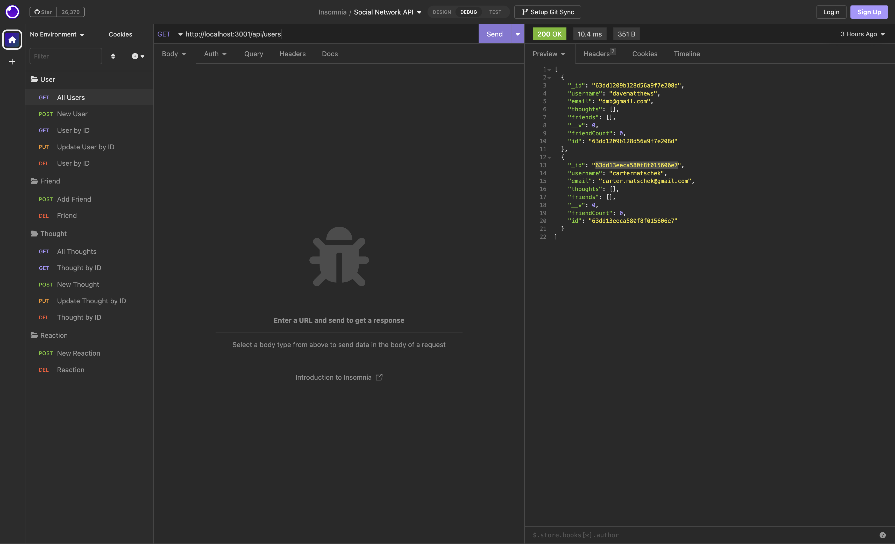

# Social Network API
  [](https://opensource.org/licenses/MIT)
  ## Description
  This project is an API for a social network web application where users can share their thoughts, react to friends’ thoughts, and create a friend list.
  ## Table of Contents
  1. [Description](#description)
  2. [Installation](#installation)
  3. [Usage](#usage)
  4. [License](#license)
  5. [Video](#video)  
    
  
  ## Installation
  To install needed dependencies, first run ```npm i``` then  ```npm start``` .  From there you can access the API in insomnia.
  ## Usage
  This can be used as the back end for a social media app.
  ## License
  [MIT](https://choosealicense.com/licenses/mit/)
  ## Video
  Demonstration Link https://app.castify.com/view/cbb01123-596a-40d9-a00c-53e1a8b1c4a4
  